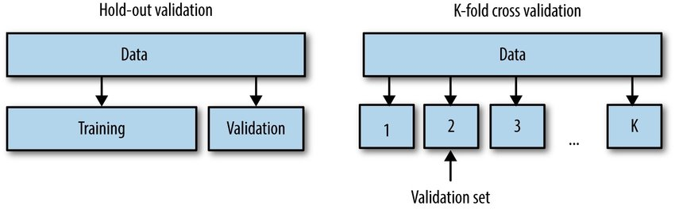

# pl_cross

Cross validation in pytorch lightning made easy :]

Just import the specialized trainer from `pl_cross` instead of `pytorch_lightning` and you are set
```python
from pl_cross import Trainer

# Normal Lightning module
model = MyModel(...)

# Use a Lightning datamodule or training dataloader
datamodule = MyDatamodule(...)

# New trainer takes all original arguments + three new for controling the cross validation
trainer = Trainer(
  num_folds=5,  # number of folds to do 
  shuffle=False,  # if samples should be shuffled before splitting
  stratified=False,  # if splitting should be done in a stratified manner
  accelerator=...,
  callbacks=...,
  ...
)

# Returns a dict of stats over the different splits
cross_val_stats = trainer.cross_validate(mode, datamodule=datamodule)

# Additionally, we can construct an ensemble from the K trained models
ensemble_model = trainer.create_ensemble(model)

```

## Installation

Requires pytorch-lightning v1.5 or newer and scikit-learn to be installed.
Simply install with
```bash
pip install pl_cross
```

## Cross-validation: why?

The core functionality of machine learning algorithms is that they are able to *learn* from data. Therefore, it is very interesting to ask the question: how *well* does our algorithms actually learn?. This is in abstract question, because it
it requires us to define what *well* means. One interpretation of this question is an algorithms ability to *generalize* e.g. a model that generalizes well have actually learned something meaningfull. 

The mathematical definition of the generalization error/expected loss/risk is given by
<p align="center">

</p>

where  is some function  denotes the loss function and  is the joint probability distribution between  and . This is the theoretical error an algorithm will do on some unobserved dataset. The problem with this definition is that we cannot compute it, due to  being unknown and even if we knew it the integral is intractable. The best we therefore can do is an *approximation* of the generalization error:

<p align="center">

</p>

which measures the error that our function  does on  datapoints measured by loss function . This function we can compute (just think of this as your normal loss function) and we even know that

<p align="center">

</p>

Namely that approximation of the generalization error will become the true generalization error if we just evaluate it on enough data. But how does all this related to cross-validation you may ask? The problem with the above is that  is not a fixed function, but data-dependent function i.e. . Thus, the above approximation will only converge if  and  refers to different sets of data points. This is where cross-validation strategies comes into play. 



<center>

| Hold out | K-fold |
|----------|--------|
|  | 

</center>

In general we consider two viable strategies for selecting the  (validation) and  (training) set: hold-out validation and K-fold cross validation. In hold out we create a separate independent set of data to evaluate our training on. This is easily done in native pytorch-lightning by implementing the `validation_step` method. For K-fold we cut our data into K equally large chunks and then we iteratively train on K-1 folds and evaluate on the remaining 1 fold, repeating this K times. In general K-fold gives a better approximation of the generalization error than hold-out, but at the expense of requiring you to train K models. 

## Some notes

* For the `.cross_validate` method to work, we in addition to the standard set of method in lightning that need
  to be implemented (`training_step` and `configure_optimizers`) we also requires the `test_step` method to be
  implemented, as we use this method evaluating the hold out set. We do not rely on the `validation_step` method
  as your models training may be dependent on the validation set (for example if you use early stopping) and your
  validation set will therefore not be truly separated from the training.

* Cross validation is always done sequentially, even if the device you are training on in principal could
  fit parallel training on multiple folds at the same time. We try to figure out in the future if we can
  parallelize the process.

* Logging can be a bit weird. Logging of training progress is essentially not important to cross-validation,
  but that does not mean that it is interesting to track. If nothing is done about the logging before calling
  `trainer.cross_validate(...)` then all `K` runs will be logged in the same experiment, which possibly will
  mess up the curves. We provide plug-in replacement for all standard loggers that essentially overwrites 
  `logger.version` argument at each fold, making sure that each fold gets its own experiment:
  ```python
  # instead of
  from pytorch_lightning.loggers import TensorboardLogger
  # do
  from pl_cross.loggers import TensorboardLogger
  ```

* Stratified splitting assume that we can extract a 1D label vector from your dataset.
  * If your dataset has an `labels` attribute, we will use that as the labels
  * If the attribute does not exist, we manually iterate over your dataset trying to
    extract the labels. By default we assume that given a `batch` the labels can be found
    as the second argument e.g. `batch[1]`. You can adjust this by initializing a 
    ```python
    from pl_cross import Trainer, KFoldDataModule
    
    model = ...

    trainer = Trainer(...)

    datamodule = KFoldDataModule(
      num_folds, shuffle, stratified,  # these should match how the trainer is initialized
      train_dataloader=my_train_dataloader,
    )
    # change the label extractor function, such that it will return the labels for a given batch
    datamodule.label_extractor = lambda batch: batch['y']

    trainer.cross_validate(model, datamodule=datamodule)
    ```
